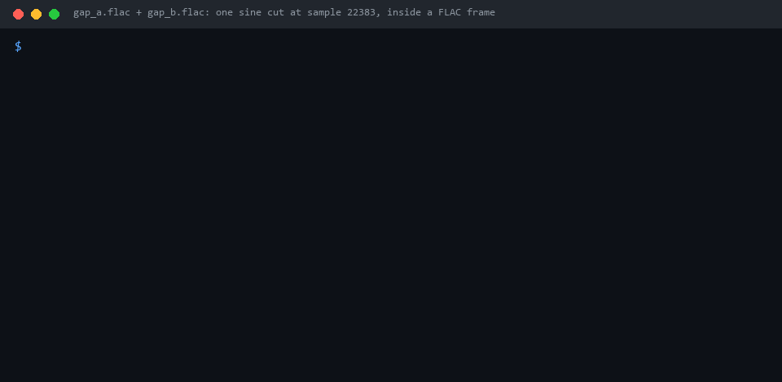

# esp32-audio-player

Audio player engine for the ESP32 in one library: FLAC, MP3, Ogg Vorbis, WAV, AIFF and DSD from an SD card, sample-exact gapless playback, CUE sheets, ReplayGain, a 10-band parametric EQ that imports AutoEQ presets, crossfeed, a queue with shuffle and resume, and output to an I2S DAC or to Bluetooth headphones.

[](https://github.com/olerast67/esp32-audio-player/actions/workflows/ci.yml)
[](https://components.espressif.com/components/olerast67/esp32-audio-player)
[](LICENSE)

[Русская версия](README.ru.md) · [API reference](https://olerast67.github.io/esp32-audio-player/) · [Changelog](CHANGELOG.md)



The engine is portable C17 and also builds on a PC. The recording above is the host command-line player from `tools/player_cli`: two FLAC files cut at sample 22383, which falls inside a FLAC frame, play back to back and match the uncut reference in all 44100 samples. The same check runs in CI (`ctest -R gapless_cli`).

## Status

Version 0.1.0 has not been run on an ESP32 yet; a photo of the test board and the first measurements (CPU load per format, RAM) will be added after the hardware test.

What is verified:

- 16 host test programs with 84981 checks pass on Windows with `zig cc`; CI runs them on Linux with AddressSanitizer and UndefinedBehaviorSanitizer and on macOS. They cover every decoder against reference CRCs of generated test files (29 files), a fuzz pass with 200 mutated copies of each file, gapless joins of FLAC and MP3, CUE splitting, resampling, the DSP chain, tag reading for ID3, APE, Vorbis comments, RIFF, AIFF, DSF, DFF, WavPack and MP4, the library index on 5000 generated files, the queue and the resume files.
- The ESP-IDF examples build for the ESP32 with ESP-IDF 6.1 without warnings, the I2S example also for the ESP32-S3.
- The Arduino examples build with the Arduino core 3.3.12 (ESP-IDF 5.5) with `-Wall -Wextra` and no warnings. The SD-to-I2S sketch takes 613 KB of flash and 25.8 KB of static RAM.

## Comparison

| | esp32-audio-player | [ESP32-audioI2S](https://github.com/schreibfaul1/ESP32-audioI2S) |
|---|---|---|
| FLAC, MP3, Ogg Vorbis, WAV | Yes | Yes |
| AAC, M4A, Opus | No | Yes |
| AIFF, DSF and DFF (as DoP) | Yes | Not listed |
| Internet radio | No | Yes |
| Output sample rate | 8 to 192 kHz, follows the file | 16 to 48 kHz |
| Sample-exact gapless | Yes, with LAME delay and padding for MP3 | Not documented |
| Equalizer | 10-band parametric, AutoEQ import | 3-band tone control |
| Crossfeed, ReplayGain, CUE | Yes | No |
| Bluetooth headphones | Yes, through [esp32-a2dp-xq](https://github.com/olerast67/esp32-a2dp-xq) | No |
| Music library index, resume, scrobble log | Yes | No |
| Tested on hardware | Not yet | Yes |

ESP32-audioI2S is the library for web radio and AAC. This one is for music stored on an SD card.

## Quick start

Arduino, a PCM5102A on BCK 26, LRCK 25, DIN 22 and an SD card on the default SPI pins with CS 5:

```cpp
#include <SD.h>
#include <audio_player.h>

void setup() {
  SD.begin(5);                                          // mounted at /sd
  audio_i2s_config_t i2s = AUDIO_I2S_CONFIG_DEFAULT();
  i2s.bck_gpio = 26; i2s.ws_gpio = 25; i2s.dout_gpio = 22;
  audio_player_esp32_config_t cfg = AUDIO_PLAYER_ESP32_CONFIG_DEFAULT();
  cfg.sink = audio_i2s_sink_create(&i2s);
  player_t *player = audio_player_start(&cfg);          // runs in its own task
  player_cmd_play_folder(player, "/sd/music", 0, false);
}

void loop() {}
```

The ESP-IDF version of the same program is [examples/idf/sd_i2s_player](examples/idf/sd_i2s_player).

## Install

ESP-IDF 5.3 or newer:

```bash
idf.py add-dependency "olerast67/esp32-audio-player^0.1.0"
```

PlatformIO (`platformio.ini`):

```ini
lib_deps = https://github.com/olerast67/esp32-audio-player.git#v0.1.0
```

Arduino IDE with the ESP32 core 3.3: download `esp32-audio-player-0.1.0.zip` from [Releases](https://github.com/olerast67/esp32-audio-player/releases) and add it with Sketch > Include Library > Add .ZIP Library. For Bluetooth output also install [esp32-a2dp-xq](https://github.com/olerast67/esp32-a2dp-xq).

A board with PSRAM (ESP32-WROVER, ESP32-S3 N8R2 or N16R8) is recommended. Decoder state, read buffers and the 200 ms output FIFO go to PSRAM when it is present; without PSRAM the FIFO takes 100 ms at up to 48 kHz (38 KB of internal RAM).

## Features

### Formats

| Format | Details |
|---|---|
| FLAC | 4 to 32 bit, mono and stereo, native and Ogg FLAC, FLAC behind an ID3v2 tag, sample-exact seeking (dr_flac) |
| MP3 | MPEG-1, 2 and 2.5 Layer I, II, III; Xing, Info and VBRI headers; LAME encoder delay and padding removed for gapless (minimp3) |
| Ogg Vorbis | Sample-exact seeking; comment packets of any size are skipped (stb_vorbis) |
| WAV | PCM 8 to 32 bit, IEEE float 32 and 64 bit, WAVE_FORMAT_EXTENSIBLE, RF64 and BW64 |
| AIFF, AIFF-C | Big-endian PCM, `sowt`, `fl32`, `fl64` |
| DSF, DFF | DSD64 as DoP at 176.4 kHz and DSD128 as DoP at 352.8 kHz; DST-compressed DFF is not supported |

Every sample inside the engine is a 32-bit integer with the audio in the top bits, so 16, 24 and 32-bit files reach an I2S DAC unchanged while all DSP stages are off. The player status reports this case as `bitperfect`.

### Playback

- Gapless: the next file is opened about 2 s before the current one ends. When both negotiate the same output format, samples continue without a gap, and the DSP and resampler keep their state across the join. A change of format plays out the tail and reopens the output.
- CUE sheets (`FILE`, `TRACK`, `INDEX 01`, `TITLE`, `PERFORMER`, `REM GAIN`), CP1251 or UTF-8. Consecutive tracks of one image share one decoder.
- Queue of up to 20000 entries with shuffle, repeat one and repeat all, "play next", jump and remove. Shuffle keeps the current track first and switching it off restores the original order.
- Resume: `player_save_state()` writes the queue as UTF-8 `queue.m3u8` and the position, volume and modes to `player.ini`, both replaced atomically. `player_restore_state()` continues paused or playing.
- Sleep timer with a 30 s fade-out, volume limit, Rockbox-format `.scrobbler.log`.

### Sound processing

The chain runs in float at the output rate: ReplayGain, preamp, parametric EQ, crossfeed, software volume, limiter, dither.

- ReplayGain from tags: track, album, or album gain only while an album plays in order; preamp, fallback gain and clipping prevention by peak.
- Parametric EQ with up to 10 bands of peak, low shelf, high shelf, low pass and high pass (RBJ biquads). `eq_preset_parse_autoeq()` reads the `ParametricEQ.txt` files of [AutoEQ](https://github.com/jaakkopasanen/AutoEq), and `eq_preset_format_autoeq()` writes the same format. Built-in presets: Flat, Bass, Treble, Vocal, Loudness.
- Crossfeed for headphones, cutoff 300 to 2000 Hz and level 1 to 15 dB.
- Limiter with about 1 ms of lookahead, TPDF dither to the resolution of the output.
- Resampling for outputs with fixed rates: cascaded half-band decimators for 2:1 and 4:1, a polyphase windowed-sinc filter for other ratios such as 48 to 44.1 kHz. The number of output samples depends only on the number of input samples, so gapless joins stay exact after resampling.

When every stage is off and the volume is at 0 dB, the samples pass untouched.

### Library and metadata

- Tags: ID3v2.2, 2.3 and 2.4, ID3v1, APEv2, Vorbis comments with FLAC pictures, RIFF INFO and `id3` chunks, MP4 and M4A atoms. Single-byte text in unknown encodings is detected as UTF-8, CP1251 or Latin-1, so CP1251 tags in old Russian MP3 files read correctly.
- Folder browsing without an index (`fs_list_dir`), sorted with collation for English and Russian.
- Music library index on the SD card: artists, albums, tracks, genres, recently added and audiobooks, built by an incremental scan into new files that replace the old ones atomically. The tests index 5000 generated files.
- M3U and M3U8 playlists, read and write.

### Outputs

- I2S DAC (`audio_i2s_sink_create`) without a control bus, for example PCM5102A, UDA1334A, ES9023 or MAX98357A. 32-bit slots, 8 to 192 kHz following each file, optional MCLK, mute and amplifier-enable pins. Mute comes before the clocks stop and after they start. DoP passes to DACs that detect it when `accept_dop` is set.
- Bluetooth headphones through [esp32-a2dp-xq](https://github.com/olerast67/esp32-a2dp-xq) (`audio_player/a2dp_sink.h`): SBC-XQ at 452 kbps with ESP-IDF 6.0+, standard SBC otherwise. The player resamples to 44.1 kHz and the headphone buttons control it.
- Outputs of your own through the `audio_sink_t` interface of `audio_player/sink.h`.

## Examples

| Example | ESP-IDF | Arduino |
|---|---|---|
| Folder on the SD card to an I2S DAC, resume after reset | [sd_i2s_player](examples/idf/sd_i2s_player) | [SdI2sPlayer](examples/arduino/SdI2sPlayer) |
| Folder on the SD card to Bluetooth headphones | [bluetooth_headphones](examples/idf/bluetooth_headphones) | [BluetoothHeadphones](examples/arduino/BluetoothHeadphones) |
| AutoEQ preset and crossfeed | | [AutoEQ](examples/arduino/AutoEQ) |
| Any file to a WAV on the PC | [tools/player_cli](tools/player_cli) | |

## Architecture

The core never creates threads. Every task may send commands (`player_cmd_*`); they only go into a queue. One audio task calls `player_run_once()` in a loop; it decodes about 1024 frames, processes them and writes them to the output, and the output write sets the pace. `audio_player_start()` creates that task on the second core with priority 18. Memory, logging, locks and the clock come from hooks in `audio_player/base.h`, which `audio_player/esp32.h` connects to ESP-IDF; the host tests use the C library defaults.

## Host build and tests

```bash
cmake -S test -B build/test
cmake --build build/test
ctest --test-dir build/test --output-on-failure
```

The build gives `player_cli`, which plays a file, a folder, an M3U playlist or a CUE sheet through the engine into a WAV file (`player_cli album/ out.wav --gapless-folder --eq autoeq.txt --rate 44100`). On Windows without a C compiler, `python -m pip install ziglang cmake ninja` and add `-G Ninja -DCMAKE_TOOLCHAIN_FILE=<absolute path>/cmake/zig-toolchain.cmake`. `-DAUDIO_PLAYER_SANITIZE=ON` adds AddressSanitizer and UndefinedBehaviorSanitizer.

## License

Apache License 2.0, see [LICENSE](LICENSE). Vendored decoders: dr_flac (Unlicense or MIT-0), minimp3 (CC0-1.0), stb_vorbis (MIT or Unlicense); details in [NOTICE](NOTICE) and [src/third_party](src/third_party/README.md). The test files in `test/data` are generated by `tools/gen_test_vectors.py` and released under CC0-1.0.

The engine comes from an ESP32 music player I am building; the player will be published after its own hardware tests.
